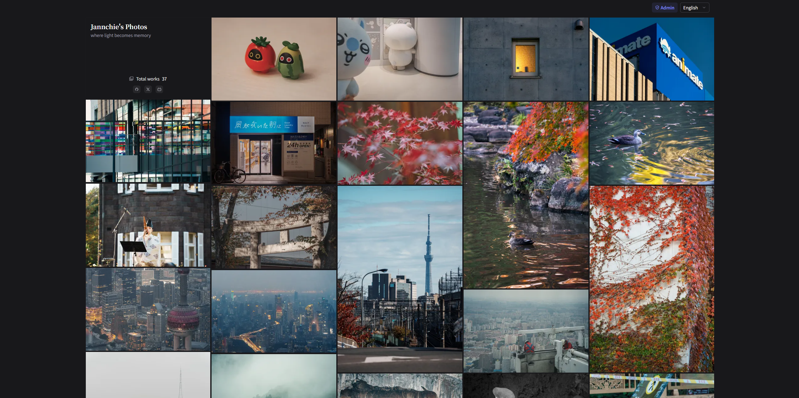

<div align="center">
  
  <h1 align="center">Liora Gallery</h1>
  
</div>



Liora Gallery is a minimal, self-hosted gallery for photography and illustrations. It pairs a public waterfall grid with an admin workspace for uploads, metadata curation, SEO, and S3-backed storage. Built on Nuxt 4, Prisma, and any S3-compatible bucket.

## Key Features

- Public gallery with thumbhash placeholders, lazy loading, and i18n (zh-CN, en, ja) backed by Nuxt UI and Tailwind.
- Admin workspace with login: EXIF/metadata autofill, location search via an OpenStreetMap Nominatim proxy, optional AI genre classification (OpenAI-compatible), duplicate detection (perceptual hash + SHA-256), and bulk reclassify.
- Storage pipeline: uploads go to an S3-compatible bucket with safe file naming; hashes, histograms, and thumbhashes are stored alongside metadata for fast lookups.
- Site controls: edit site name, description, icon, and social links from the admin panel; Open Graph images are generated automatically.
- SEO and PWA: `@nuxtjs/seo` for canonical links/sitemap/robots, Nuxt OG images, and `@vite-pwa/nuxt` for installable experiences.

## Requirements

- Node.js 22+ and pnpm 10+
- S3-compatible storage (MinIO, Cloudflare R2, Wasabi, AWS S3, etc.) for uploads
- SQLite/LibSQL database URL (defaults to a local SQLite file)
- Optional: OpenAI-compatible API key for genre classification

## Getting Started

1. Copy envs and fill required values:

   ```bash
   cp .env.example .env
   ```

2. Install dependencies:

   ```bash
   pnpm install
   ```

3. Start the dev server:

   ```bash
   pnpm dev
   ```

4. Visit <http://localhost:3000> (admin console at `/admin`). Local data lives in `prisma/data.db`; run migrations if you change the schema.

## Configuration

Core environment variables:

| Variable               | Required    | Description                                                                                        | Example                          |
| ---------------------- | ----------- | -------------------------------------------------------------------------------------------------- | -------------------------------- |
| `ADMIN_USERNAME`       | Yes         | Admin login for `/admin`                                                                           | `admin`                          |
| `ADMIN_PASSWORD`       | Yes         | Admin password                                                                                     | `change-me`                      |
| `ADMIN_SESSION_SECRET` | Recommended | Session signing secret (falls back to password if empty)                                           | `please-change-me`               |
| `DATABASE_URL`         | Optional    | SQLite/LibSQL connection. Default: `file:./prisma/data.db` locally, `file:/data/data.db` in Docker | `libsql://host/db?authToken=...` |
| `S3_ENDPOINT`          | Yes         | S3-compatible endpoint (no trailing slash)                                                         | `https://s3.example.com`         |
| `S3_BUCKET`            | Yes         | Bucket name                                                                                        | `liora`                          |
| `S3_ACCESS_KEY_ID`     | Yes         | Access key                                                                                         | `AKIA...`                        |
| `S3_SECRET_ACCESS_KEY` | Yes         | Secret key                                                                                         | `...`                            |
| `S3_PUBLIC_BASE_URL`   | Optional    | Public base URL/CDN prefix for serving files                                                       | `https://cdn.example.com/liora`  |
| `SITE_URL`             | Recommended | Canonical site URL for SEO/sitemap                                                                 | `https://gallery.example.com`    |
| `SITE_INDEXABLE`       | Optional    | `true`/`false` to control robots/sitemap                                                           | `true`                           |
| `OPENAI_API_KEY`       | Optional    | Enables AI genre classification                                                                    | `sk-...`                         |

Social links (rendered only when set): `SOCIAL_HOMEPAGE`, `SOCIAL_GITHUB`, `SOCIAL_TWITTER`, `SOCIAL_INSTAGRAM`, `SOCIAL_WEIBO`, `SOCIAL_YOUTUBE`, `SOCIAL_BILIBILI`, `SOCIAL_TIKTOK`, `SOCIAL_LINKEDIN`.

Legacy `NUXT_*` variants continue to work for backward compatibility, but prefer the prefix-less names above.

## Local Development

- Dev server: `pnpm dev`
- Lint: `pnpm exec eslint .`
- Tests (add specs under `tests/` or alongside features): `pnpm exec vitest`
- Production build/preview: `pnpm build && pnpm preview`
- Static export (when needed): `pnpm generate`

## Database

- Prisma schema lives in `prisma/schema.prisma`; local SQLite file is `prisma/data.db`.
- Apply schema changes: `pnpm exec prisma migrate dev --name <message>`
- Regenerate client (after schema edits): `pnpm exec prisma generate`
- Docker images run `pnpm exec prisma migrate deploy` on startup; mount `/data` to persist SQLite (`DATABASE_URL=file:/data/data.db` baked into the image).
- Utility scripts:
  - `pnpm backfill:exif`: parse EXIF and backfill metadata fields (camera, lens, exposure, capture time, etc.).
  - `pnpm backfill:thumbhash`: fetch stored images, compute thumbhash/perceptual hash/SHA-256, and store them in metadata.

## Deployment

### Manual build

- Install dependencies: `pnpm install`
- Build and preview: `pnpm build && pnpm preview`

### Docker

- Build and run:

  ```bash
  docker build -t liora .
  docker run --rm -p 3000:3000 --env-file .env liora
  ```

- Defaults: listens on `0.0.0.0:3000`; `DATABASE_URL=file:/data/data.db`. Override `HOST`/`PORT` or mount `/data` to persist SQLite.
- Prisma migrations (`pnpm exec prisma migrate deploy`) run at container start. Use `scripts/build-docker.sh` and `scripts/publish-docker.sh` to tag/push images (`IMAGE_NAME` overridable).
- Persist SQLite with a host directory (example: `/srv/liora-db`):

  ```bash
  docker run -d --name liora \
    -p 3000:3000 \
    --env-file .env \
    -v /srv/liora-db:/data \
    liora:latest
  ```

- Compose example:

  ```yaml
  services:
    liora:
      build: .
      image: liora:latest
      ports:
        - '3000:3000'
      env_file: .env
      volumes:
        - /srv/liora-db:/data
      restart: unless-stopped
  ```

## Operations

- Back up the SQLite file (`prisma/data.db` locally or `/data` in Docker) and your S3 bucket regularly.
- Set `SITE_URL`/`SITE_INDEXABLE` appropriately before exposing to crawlers.
- Geocoding uses a proxied Nominatim API; calls are throttled server-side (1 request/second).
- AI classification is optional; uploads still succeed without `OPENAI_API_KEY`.

## Troubleshooting

- Upload fails with “S3-compatible storage is not configured”: check `S3_*` envs and bucket permissions.
- Upload rejected with a conflict: a perceptual/SHA-256 duplicate was detected. Upload a different image or adjust the source.
- Geocoding slow or failing: Nominatim rate limits; try later or fill coordinates manually.
- Classification unavailable: verify `OPENAI_API_KEY`; admins can still set genres manually or use the reclassify action.
- Admin login rejected: ensure `ADMIN_USERNAME`/`ADMIN_PASSWORD` are set and the server restarted after changes.

## Contributing

Use pnpm, keep commits focused (Conventional Commits), and run `pnpm exec eslint .` plus `pnpm exec vitest` before opening a PR. See `CHANGELOG.md` for recent updates; licensing is MIT.

## License

MIT License. See `LICENSE` for details.
